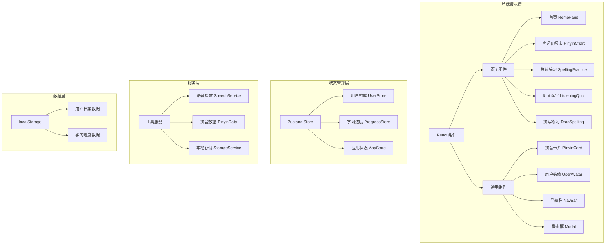
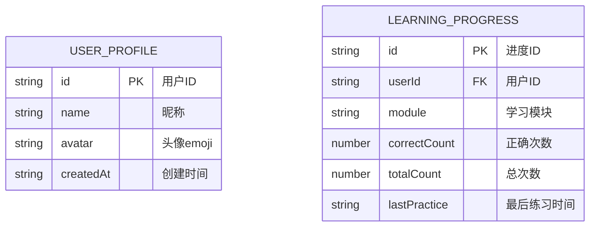

## 1. 架构设计



## 2. 技术描述

- **前端框架**：React@18 + TypeScript
- **构建工具**：Vite@5
- **样式方案**：TailwindCSS@3
- **状态管理**：Zustand
- **路由管理**：react-router-dom@6
- **图标库**：lucide-react
- **语音API**：Web Speech API (SpeechSynthesis)
- **拖拽实现**：原生HTML5 Drag and Drop API + 触摸事件兼容
- **数据持久化**：localStorage
- **开发服务器端口**：50321

## 3. 路由定义

| 路由 | 用途 |
|-------|---------|
| / | 首页 - 用户档案列表和管理 |
| /chart | 声母韵母表 |
| /spelling | 拼读练习 |
| /listening | 听音选字 |
| /drag | 拼写练习（拖拽） |

## 4. 数据模型

### 4.1 数据模型定义



### 4.2 数据结构定义（TypeScript）

```typescript
interface UserProfile {
  id: string;
  name: string;
  avatar: string;
  createdAt: string;
}

interface LearningProgress {
  id: string;
  userId: string;
  module: 'chart' | 'spelling' | 'listening' | 'drag';
  correctCount: number;
  totalCount: number;
  lastPractice: string;
}

interface PinyinItem {
  pinyin: string;
  type: 'shengmu' | 'yunmu';
  example?: string;
  mouthShape?: string;
}

interface QuizOption {
  pinyin: string;
  isCorrect: boolean;
}
```

### 4.3 拼音数据

**声母（23个）**：b, p, m, f, d, t, n, l, g, k, h, j, q, x, zh, ch, sh, r, z, c, s, y, w

**韵母（24个）**：
- 单韵母：a, o, e, i, u, ü
- 复韵母：ai, ei, ui, ao, ou, iu, ie, üe, er
- 前鼻韵母：an, en, in, un, ün
- 后鼻韵母：ang, eng, ing, ong

**四声声调**：ˉ (一声), ˊ (二声), ˇ (三声), ˋ (四声)

## 5. 目录结构

```
src/
├── components/           # 通用组件
│   ├── NavBar.tsx        # 顶部导航栏（含用户切换）
│   ├── PinyinCard.tsx    # 拼音卡片组件
│   ├── UserAvatar.tsx    # 用户头像组件
│   ├── Modal.tsx         # 模态框组件
│   └── Celebration.tsx   # 庆祝动画组件
├── pages/                # 页面组件
│   ├── HomePage.tsx      # 首页（用户档案管理）
│   ├── PinyinChart.tsx   # 声母韵母表
│   ├── SpellingPractice.tsx  # 拼读练习
│   ├── ListeningQuiz.tsx     # 听音选字
│   └── DragSpelling.tsx      # 拼写练习（拖拽）
├── store/                # Zustand状态管理
│   ├── userStore.ts      # 用户档案状态
│   └── progressStore.ts  # 学习进度状态
├── utils/                # 工具函数
│   ├── pinyinData.ts     # 拼音数据
│   ├── speech.ts         # 语音播放服务
│   └── storage.ts        # 本地存储服务
├── types/                # TypeScript类型定义
│   └── index.ts
├── App.tsx               # 应用入口
├── main.tsx              # 渲染入口
└── index.css             # 全局样式
```

## 6. 核心服务说明

### 6.1 语音播放服务（SpeechService）
- 封装 Web Speech API 的 SpeechSynthesis
- 支持中文普通话发音
- 支持带声调的拼音朗读
- 提供播放/暂停/停止控制

### 6.2 本地存储服务（StorageService）
- 封装 localStorage 操作
- 用户档案的增删改查
- 学习进度的持久化
- JSON 序列化/反序列化

### 6.3 拼音数据服务（PinyinData）
- 提供声母韵母数据
- 拼音组合规则
- 声调标记工具函数
- 随机题目生成
