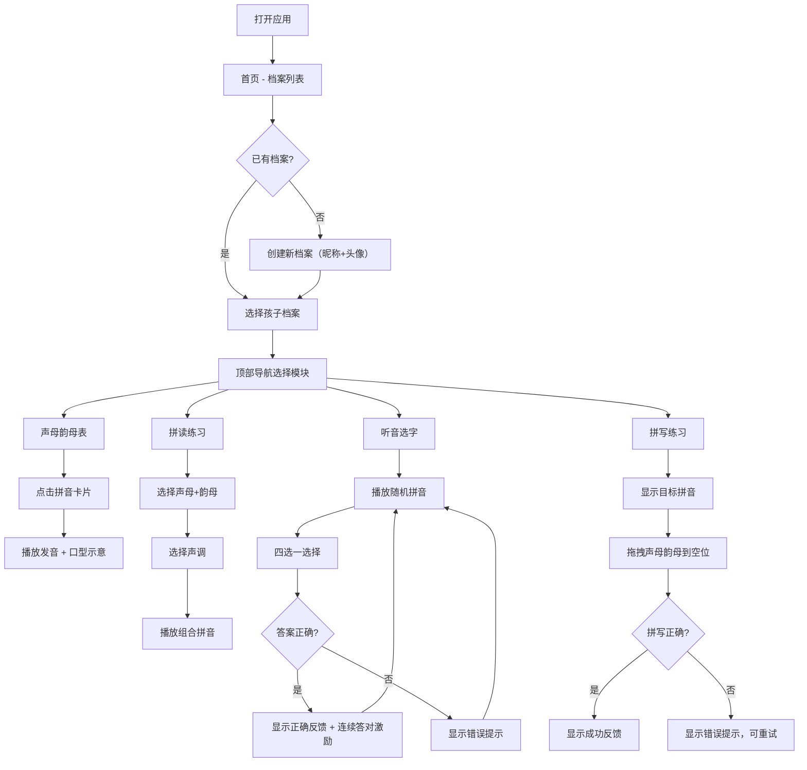

## 1. 产品概述

儿童拼音学习平台是一款面向3-8岁儿童的交互式拼音学习Web应用，通过游戏化的方式帮助孩子学习汉语拼音的声母、韵母、拼读和拼写。
- 主要目的：让儿童在趣味互动中系统学习汉语拼音，掌握正确发音和拼写规则
- 目标用户：学龄前儿童和小学低年级学生，以及需要辅导孩子学习拼音的家长

## 2. 核心功能

### 2.1 用户角色

| 角色 | 注册方式 | 核心权限 |
|------|----------|----------|
| 儿童用户 | 创建档案（昵称+头像） | 学习所有拼音模块、查看个人学习进度 |

### 2.2 功能模块

1. **首页/用户档案管理**：孩子档案列表、添加孩子、快速切换用户
2. **声母韵母表**：23个声母展示、24个韵母展示、分类切换、发音播放、口型示意
3. **拼读练习**：声母选择、韵母选择、声调标记、组合拼音展示、发音播放
4. **听音选字**：随机拼音播放、四选一选项、即时反馈、连续答对激励动画
5. **拼写练习（拖拽）**：目标拼音展示、声母韵母拖拽、自动校验、反馈提示

### 2.3 页面详情

| 页面名称 | 模块名称 | 功能描述 |
|-----------|-------------|---------------------|
| 首页 | 用户档案列表 | 展示已有孩子档案（头像+昵称），点击切换当前用户 |
| 首页 | 添加孩子 | 弹窗表单，输入昵称、选择头像，创建新档案 |
| 首页 | 顶部导航栏 | 用户切换栏、功能模块入口 |
| 声母韵母表 | 分类切换 | 声母/韵母标签页切换 |
| 声母韵母表 | 拼音卡片 | 展示拼音字符，点击播放发音，显示口型示意 |
| 拼读练习 | 声母选择区 | 左侧展示所有声母供选择 |
| 拼读练习 | 韵母选择区 | 右侧展示所有韵母供选择 |
| 拼读练习 | 组合结果区 | 显示声母+韵母+声调的组合拼音 |
| 拼读练习 | 声调按钮 | 四个声调按钮（ˉˊˇˋ），点击标调 |
| 拼读练习 | 播放按钮 | 朗读组合后的完整拼音 |
| 听音选字 | 播放按钮 | 系统随机播放一个拼音发音（含声调） |
| 听音选字 | 选项区 | 四个拼音选项（包含干扰项） |
| 听音选字 | 反馈区 | 即时反馈对错、连续答对激励动画（⭐或🎉） |
| 拼写练习 | 目标展示区 | 显示目标拼音及对应汉字/图片提示 |
| 拼写练习 | 声母区 | 可拖拽的声母卡片 |
| 拼写练习 | 韵母区 | 可拖拽的韵母卡片 |
| 拼写练习 | 拼写区 | 两个空位用于放置声母和韵母 |
| 拼写练习 | 校验反馈 | 组合完成后自动校验，给出反馈 |

## 3. 核心流程

### 3.1 用户学习流程

用户打开应用 → 选择或创建孩子档案 → 选择学习模块（声母韵母表/拼读练习/听音选字/拼写练习）→ 进行学习练习 → 系统记录学习进度

### 3.2 核心流程图

## 4. 用户界面设计

### 4.1 设计风格

- **主色调**：温暖明亮的橙色系（#FF7A45 为主色），搭配清新的天蓝色（#4ECDC4）作为辅助色
- **背景色**：柔和的渐变背景，从浅蓝到浅粉，营造童趣氛围
- **按钮风格**：圆润饱满的3D效果按钮，带有微微阴影和悬停放大效果
- **字体**：使用圆润可爱的字体（如"ZCOOL KuaiLe"或"Ma Shan Zheng"），适合儿童阅读
- **布局风格**：卡片式布局，大圆角，大留白，色彩鲜艳活泼
- **图标风格**：使用Emoji和可爱的卡通图标，增强趣味性

### 4.2 页面设计概述

| 页面名称 | 模块名称 | UI元素 |
|-----------|-------------|-------------|
| 首页 | 用户档案列表 | 圆形头像卡片、昵称、选中高亮效果、悬停放大动画 |
| 首页 | 添加孩子按钮 | 大号圆形+按钮，渐变背景，弹跳动画 |
| 声母韵母表 | 分类标签 | 胶囊形状标签，选中状态高亮，平滑过渡动画 |
| 声母韵母表 | 拼音卡片 | 圆角卡片，渐变背景，点击缩放动画，发音时脉冲效果 |
| 拼读练习 | 声母/韵母选择区 | 网格布局卡片，选中高亮，点击反馈 |
| 拼读练习 | 组合结果区 | 大号字体展示，带声调标注，居中突出显示 |
| 拼读练习 | 声调按钮 | 四个圆形按钮，不同颜色区分，点击高亮 |
| 听音选字 | 播放按钮 | 大号播放图标按钮，点击波纹动画 |
| 听音选字 | 选项卡片 | 四个等大卡片，正确时绿色闪烁，错误时红色抖动 |
| 听音选字 | 激励动画 | ⭐🎉 emoji从下往上飘散动画 |
| 拼写练习 | 目标展示区 | 大号拼音+汉字，背景高亮突出 |
| 拼写练习 | 拖拽卡片 | 可拖拽，带阴影，拖拽时半透明放大 |
| 拼写练习 | 拼写空位 | 虚线边框占位，放置成功时填充动画 |

### 4.3 响应式设计

- 桌面端优先设计，适配平板和移动端
- 卡片布局使用CSS Grid自适应列数
- 触摸设备优化拖拽交互（支持触摸拖拽）
- 字体大小随屏幕尺寸自适应调整

### 4.4 动画与交互

- 页面加载时元素渐入动画（stagger效果）
- 按钮悬停时轻微放大（scale 1.05）
- 卡片点击时缩放反馈（scale 0.95）
- 正确答案绿色脉冲动画
- 错误答案红色抖动动画
- 连续答对时星星/彩带飘散动画
